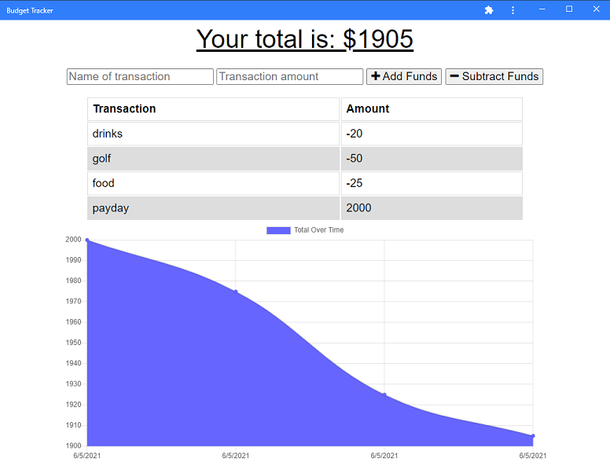

# budget-tracker

## Description
Keeping track of finances can be hard especially when you can just swipe that little piece of plastic and not think about it. But that is not a very responsible way to think about your finances, so I made a budget tracker app! This app allows the user to enter transactions that add and remove funds when they are entered, then those funds are represented graphically to see if the user has a net increase or decrease in their financial situation. The app uses mongoDB and mongoose to store the user's financial transactions, indexedDB to store any transactions that are made when the user does not have an internet connection, and it is also a progressive web app so it can be downloaded on to a phone or desktop!  

The app is published at [Budget Tracker](https://cryptic-eyrie-12746.herokuapp.com/).

## Screenshot

## Installation
For users follow the Budget Tracker link at the end of the description and find the download button next to the favorite button in your search bar.
For developers simply clone the repository and install the express, mongodb, and mongoose dependencies.

## Usage
This is an open source project so feel free to use this budget tracker to track your own finances!

***

## Contribution
If you have an idea to make this project better you are more than welcome to contribute and improve it for future users!

## Tests
The only test for this app is to use it. Enter your own transactions and submit them!

## License
This project is under the [WTFPL](http://www.wtfpl.net/about/) license so it is free to use in whatever way you want.

## GitHub
Check out my repository and other projects at my [GitHub](https://github.com/jasonpsmith180)!

## Questions
For any questions or comments feel free to email me at jasonpsmith180@gmail.com.